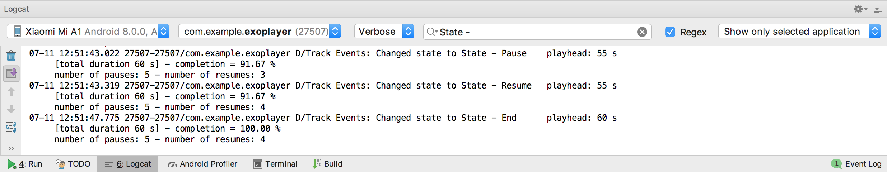

# Mobile Monitoring Test
## Objective
Develop a solution to monitor/track mobile video player behavior.

## Description
The solution will be developed with **Android** using the library **ExoPlayer**.
The project is modularised to have media player activity ready for being used in different APKs for mobile, Android TV, and Instant App.

## Set up
You can get the code from GitHub
https://github.com/ivanmolto/exoplayer-monitoring.git

And as this is an Android Studio project,  it can be imported with Android Studio as its own project.
For importing the project, please start Android Studio and choose File -> New -> Import Project..
Once the build has finished, you will see two modules:
* The `app` module (with only a manifest).
* The `player-lib`.
As you can see the `app` module merges in the `player-lib` module with a gradle dependency.

It is also interesting to mention the ExoPlayer dependencies as in this project only the following modules from ExoPlayer are used:
* com.google.android.exoplayer:exoplayer-core:2.8.0
* com.google.android.exoplayer:exoplayer-dash:2.8.0
* com.google.android.exoplayer:exoplayer-ui:2.8.0

## Track Events
An ExoPlayer.EventListener has been implemented to track some events and send a console output every time one of the following events happen:
* The reproduction/video starts.
* The player is paused/resumed.
* The reproduction/video ends.

`onPlayerStateChanged` is called when the media player transitions from one playback state to another or if playback is played or set to pause. 
The `playbackState` reports the differents states of the playback:
* `ExoPlayer.STATE_IDLE`: The media player instantiated but still not prepared with a `MediaSource`.
* `ExoPlayer.STATE_BUFFERING`: Not enough data is buffered and so the media player is not able to play.
* `ExoPlayer.STATE_READY`: The media player is able to play from the current position. The first time `playWhenReady` is true, the media player starts to play media, the rest of the times the media player resumes. On the other hand, if `playWhenReady` is false, the player is paused.
* `ExoPlayer.STATE_ENDED`: The media player has finished playing.

## Calculate Metrics
Every time a previous event happens, calculate and send a console output:
* Playhead (current video position, in seconds) `playbackPosition`.
* Total duration of the video `totalDuration`.
* % of video completion `completion`.
* Number of pauses/resumes that happened with reset after reproductions ends `pauses`/`resumes`.

Please see below a screenshot of monitoring mobile video player with this application.

## Resources
To test the app we use the online video:
https://www.quirksmode.org/html5/videos/big_buck_bunny.mp4
